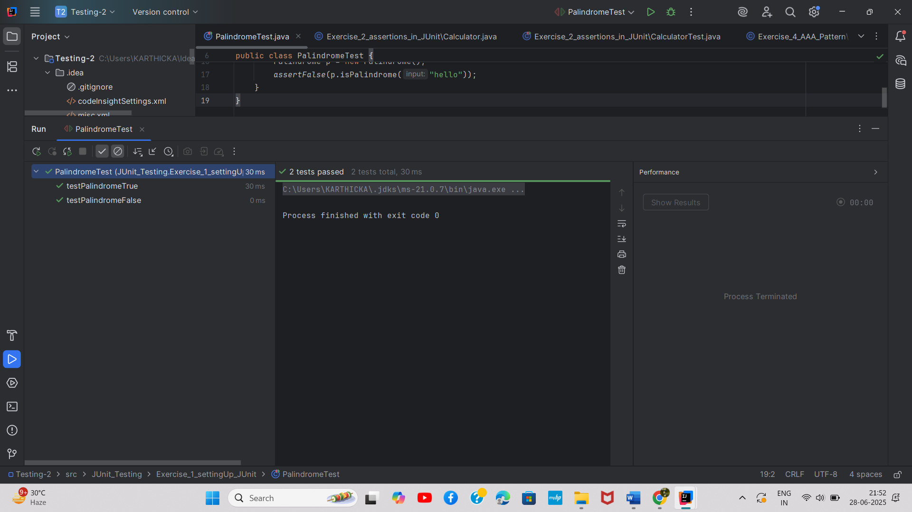

# Exercise 1: Setting Up JUnit

## Overview
This exercise demonstrates the setup and configuration of JUnit testing framework in a Java project.

## Output

## Key Learnings
- Setting up JUnit dependencies in the project
- Basic test configuration
- Running first JUnit test
