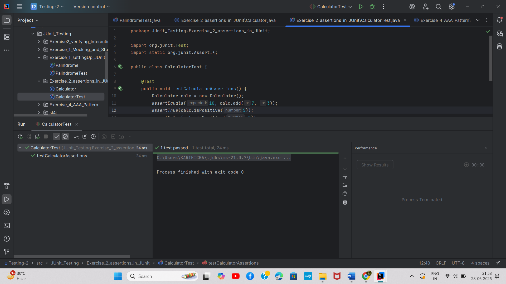

# Exercise 2: Assertions in JUnit

## Overview
This exercise covers various assertion methods available in JUnit for testing different conditions and validating test results.

## Output

## Key Learnings
- Understanding different assertion methods
- assertEquals, assertTrue, assertFalse, assertNull, assertNotNull
- Writing comprehensive test assertions
