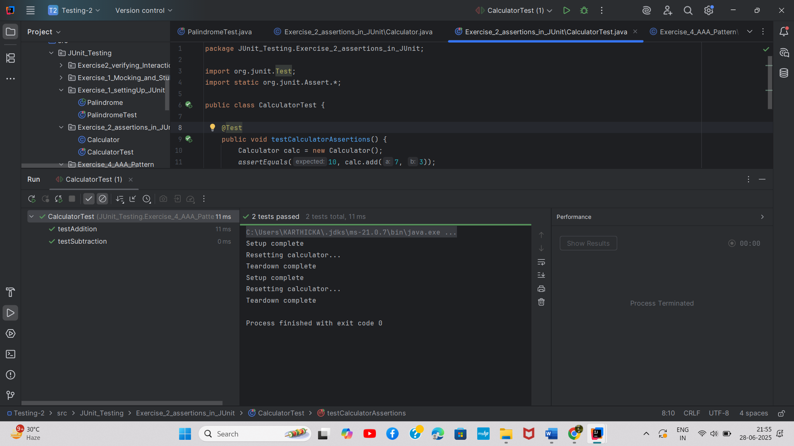

# Exercise 4: AAA Pattern in JUnit

## Overview
This exercise demonstrates the Arrange-Act-Assert (AAA) pattern for structuring unit tests in a clear and maintainable way.

## Output

## Key Learnings
- Arrange: Setting up test data and preconditions
- Act: Executing the method under test
- Assert: Verifying the expected outcomes
- Writing well-structured and readable tests
