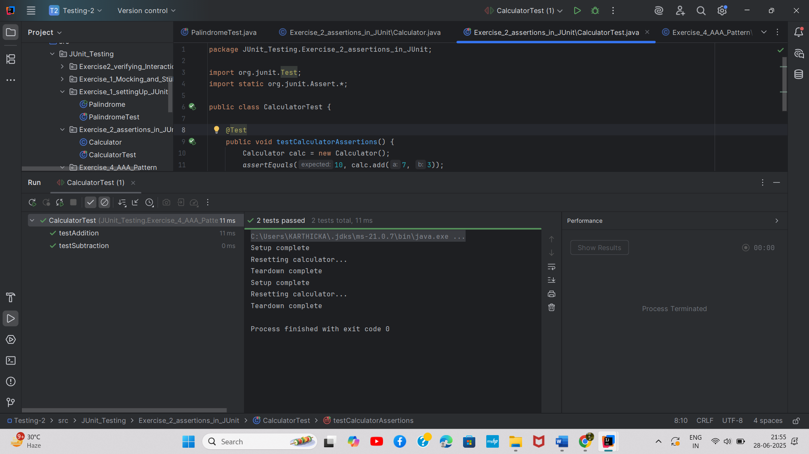

# Mockito Framework

## Overview
This exercise demonstrates the use of Mockito framework for creating mock objects and testing external dependencies in isolation.

## Output

## Key Learnings
- Creating mock objects with Mockito
- Stubbing method calls
- Verifying interactions with mocked dependencies
- Testing services with external API dependencies
