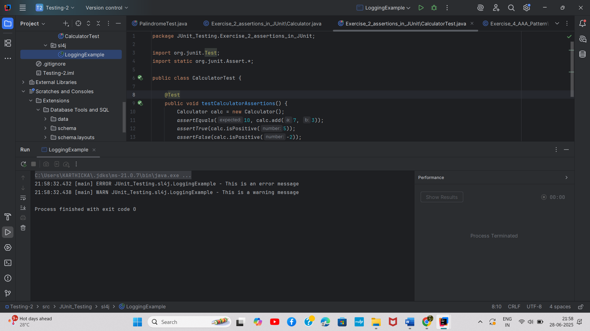

# SLF4J Logging Framework

## Overview
This exercise demonstrates the implementation of logging using SLF4J (Simple Logging Facade for Java) framework.

## Output

## Key Learnings
- Setting up SLF4J logging framework
- Different logging levels (DEBUG, INFO, WARN, ERROR)
- Configuring logging output format
- Best practices for application logging
