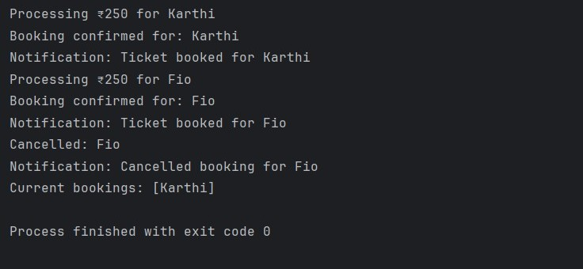

# Exercise 4: Creating and Configuring a Maven Project

## Overview
This exercise demonstrates how to create and configure a Maven project for Spring applications with proper dependency management.

## Output

## Key Learnings
- Setting up Maven project structure
- Configuring pom.xml with Spring dependencies
- Managing project dependencies with Maven
- Building and running Spring applications with Maven
