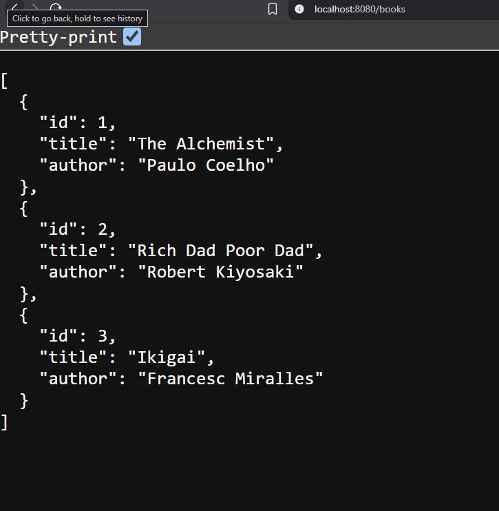

# Exercise 9: Spring JPA - ORM Learn

## Overview
This exercise demonstrates Spring Data JPA and Hibernate ORM concepts using a Country entity. The application showcases database operations, entity mapping, and JPA repository patterns.

## Output

## Key Learnings
- Spring Data JPA with Hibernate ORM
- Entity mapping with @Entity, @Table, @Column annotations
- JPA Repository implementation
- Database table mapping and field customization
- Spring Boot application with JPA configuration
- CRUD operations using Spring Data JPA
