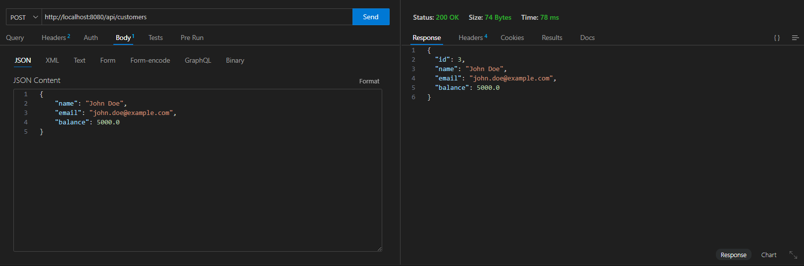
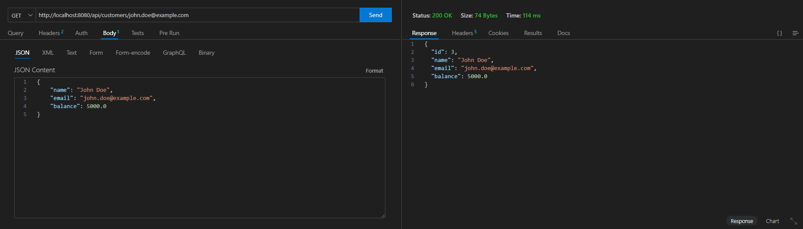

# Exercise: Spring Data JPA Handson - Banking System

## Overview
This exercise demonstrates implementing a Banking System using Spring Data JPA with MySQL database. The application provides REST APIs for customer management with CRUD operations.

## Output

### POST API - Create Customer
**POST** `http://localhost:8080/api/customers`

### GET API - Get Customer by Email
**GET** `http://localhost:8080/api/customers/john.doe@example.com`

## Key Learnings
- Spring Data JPA repository pattern
- JPA entity mapping and relationships
- RESTful API design with Spring Boot
- MySQL database integration
- CRUD operations with Spring Data JPA
- Custom query methods in repositories
