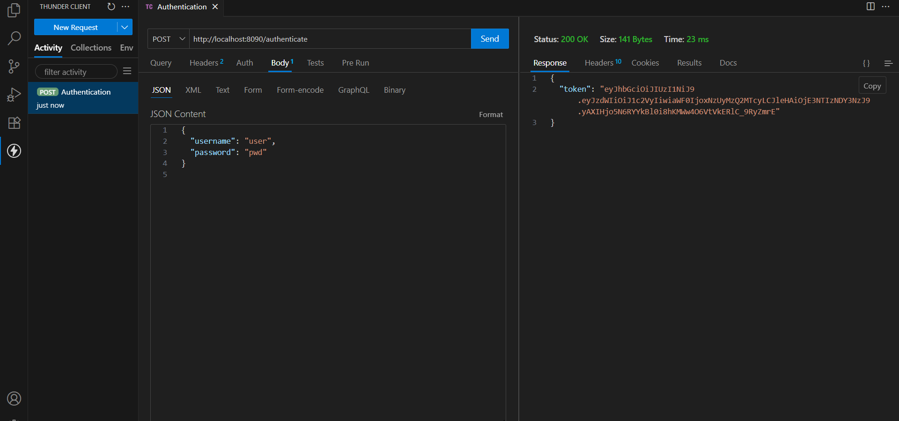

# Create Authentication Service that Returns JWT

## Overview
This exercise demonstrates implementing JWT (JSON Web Token) based authentication service for securing REST APIs.

## Output

## Key Learnings
- JWT token generation and validation
- User authentication and authorization
- Security configuration in Spring Boot
- Token-based authentication flow
