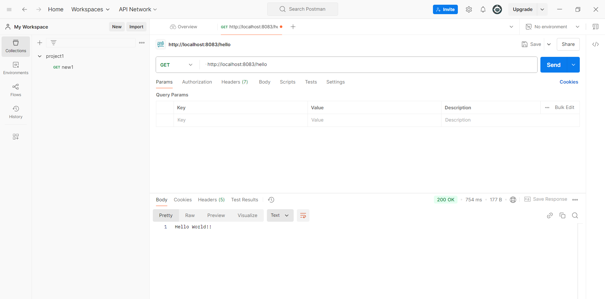

# Hello World RESTful Web Service

## Overview
This exercise demonstrates creating a simple "Hello World" RESTful web service using Spring Boot framework.

## Output

## Key Learnings
- Creating REST controllers with @RestController
- Implementing GET endpoints
- Understanding HTTP methods in REST
- Testing RESTful endpoints
