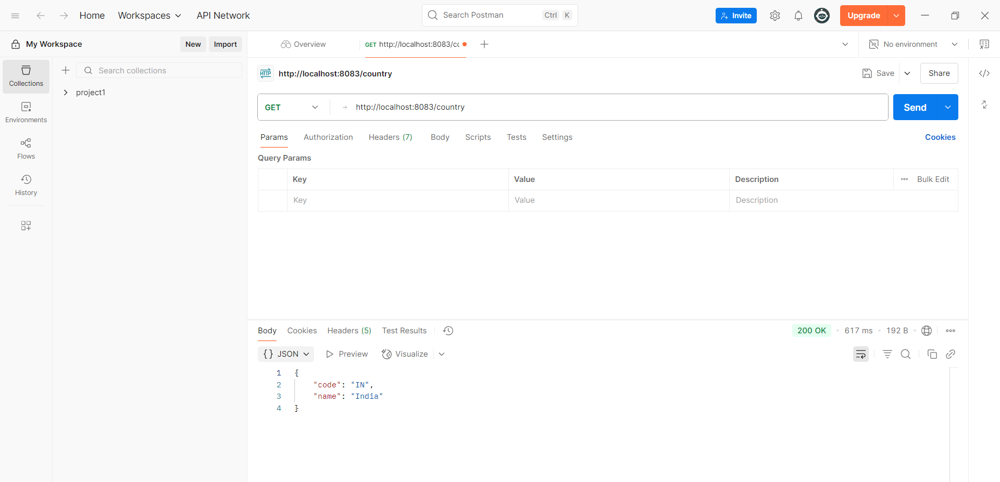

# REST - Country Web Service

## Overview
This exercise demonstrates building a comprehensive REST web service for managing country data with CRUD operations.

## Output

## Key Learnings
- Building RESTful CRUD operations
- Working with JSON data format
- Implementing POST, GET, PUT, DELETE methods
- Data model design for REST services
