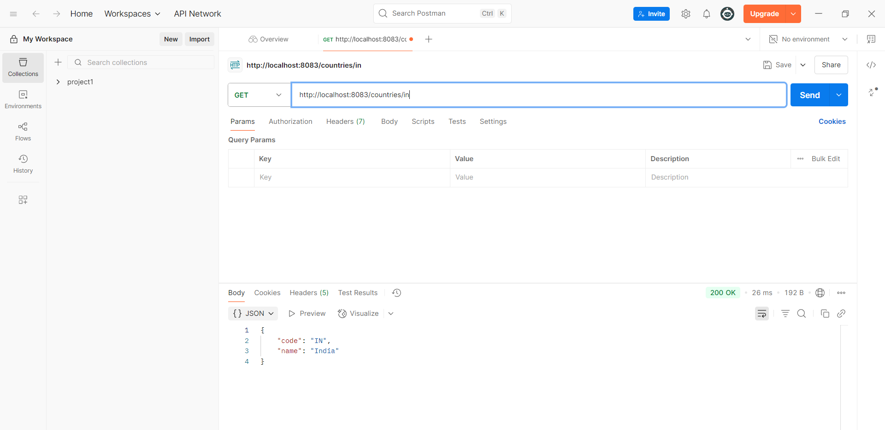

# REST - Get Country Based on Country Code

## Overview
This exercise demonstrates implementing a REST endpoint that retrieves country information based on country code parameters.

## Output

## Key Learnings
- Path variable handling in REST endpoints
- Parameter validation and processing
- Error handling for invalid inputs
- Response formatting for REST APIs
