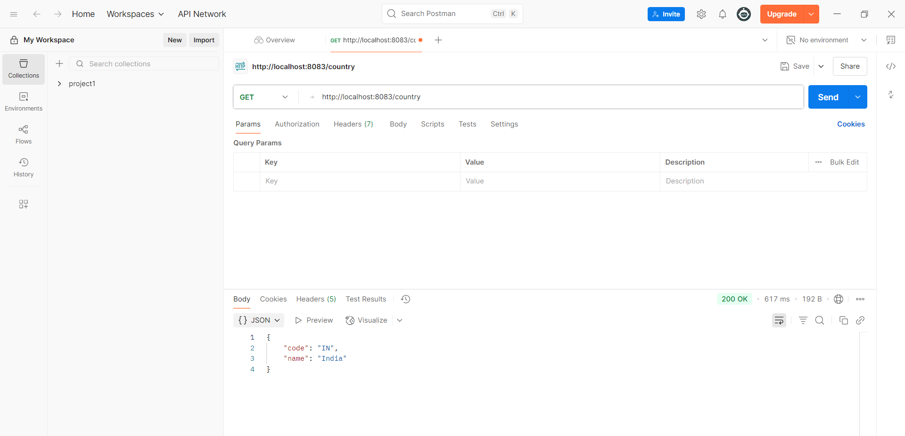

# Spring Core - Load Country from Spring Configuration XML

## Overview
This exercise demonstrates loading country data using Spring's XML configuration and integrating it with REST services.

## Output

## Key Learnings
- XML-based Spring configuration
- Loading data through Spring context
- Integration of Spring Core with REST services
- Bean configuration and initialization
