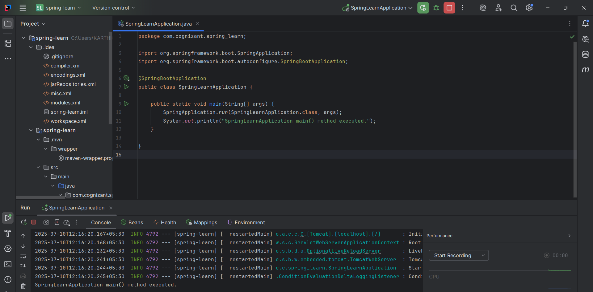

# Creating Spring Web Project with Maven

## Overview
This exercise demonstrates how to create a Spring web project using Maven for building RESTful web services.

## Output

## Key Learnings
- Setting up Spring web project with Maven
- Configuring web application dependencies
- Project structure for web applications
- Maven build configuration for Spring web
