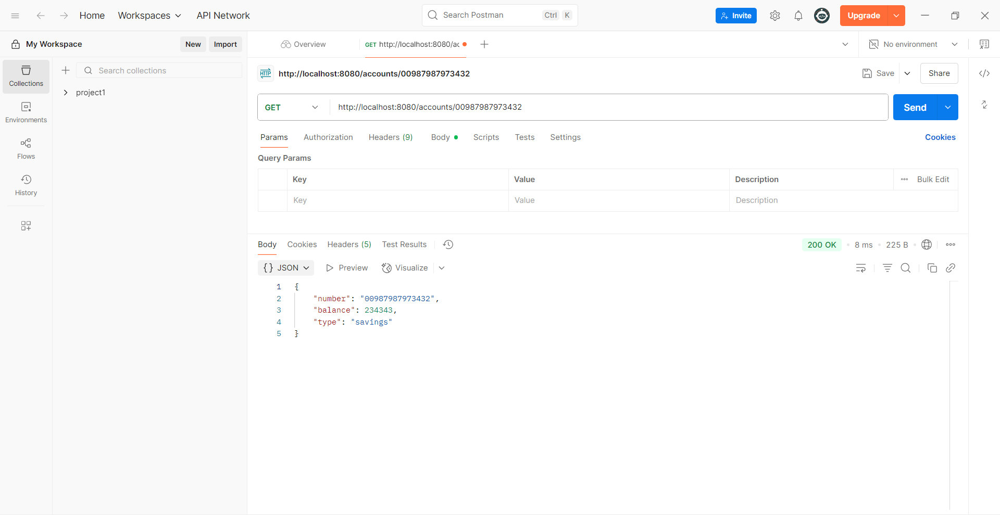

# Account Microservice

## Overview
This exercise demonstrates building an Account microservice as part of a microservices architecture using Spring Boot and Spring Cloud.

## Output

## Key Learnings
- Microservice architecture principles
- Service registration and discovery
- RESTful API design for microservices
- Inter-service communication patterns
