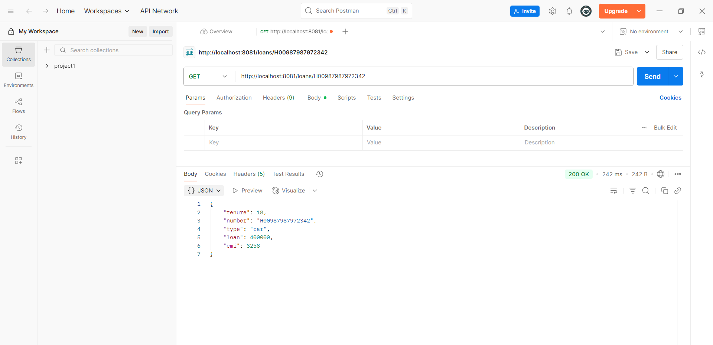

# Loan Microservice

## Overview
This exercise demonstrates building a Loan microservice that works in conjunction with other microservices in the ecosystem.

## Output

## Key Learnings
- Domain-specific microservice design
- Database per microservice pattern
- Service communication and data consistency
- Business logic encapsulation in microservices
