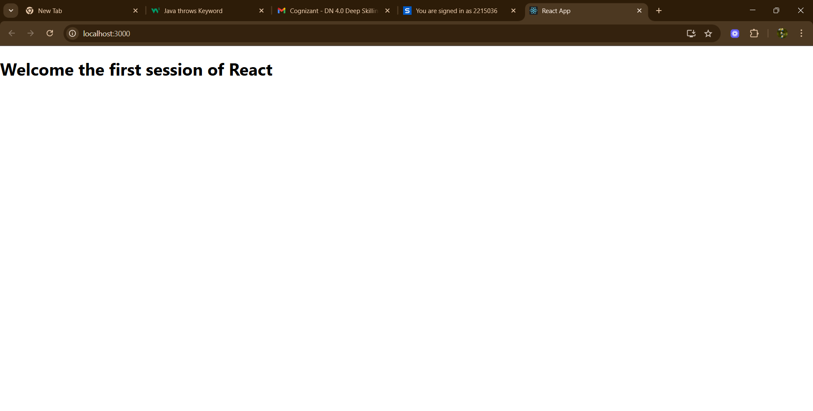

# Exercise 1: My First React App

## Overview
This exercise introduces the basics of React by creating a simple "Hello World" React application.

## Output

## Key Learnings
- Setting up React development environment
- Creating React components
- Understanding JSX syntax
- Running React applications
