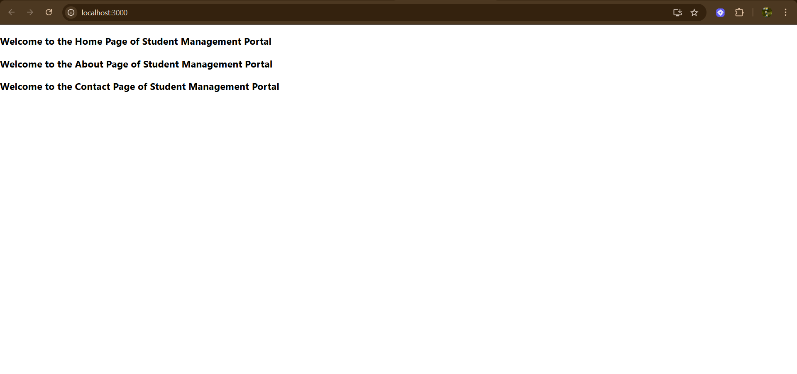

# Exercise 2: Student App

## Overview
This exercise demonstrates building a React application for managing student information with multiple components and navigation.

## Output

## Key Learnings
- Multi-component React applications
- Component composition and reusability
- Props and state management
- Navigation between components
