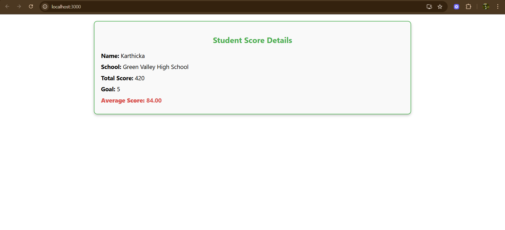

# Exercise 3: Score Calculator App

## Overview
This exercise demonstrates building a React application that calculates and displays scores with interactive input handling.

## Output

## Key Learnings
- Handling user input in React
- State management for calculations
- Event handling and form processing
- Dynamic content rendering based on calculations
