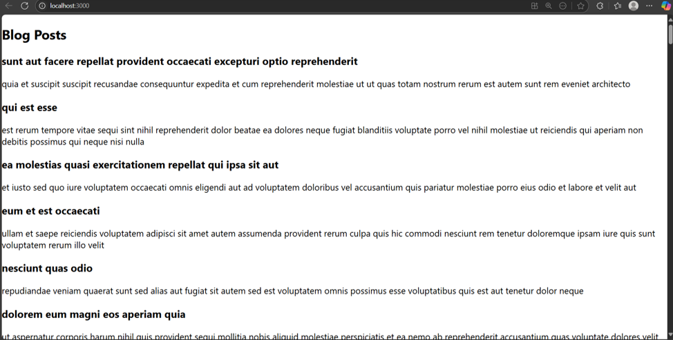

# Exercise 4: Blog App

## Overview
This exercise demonstrates building a React blog application with post management functionality and dynamic content display.

## Output

## Key Learnings
- Managing lists of data in React
- Component lifecycle and data flow
- Creating reusable UI components
- Handling dynamic content rendering
