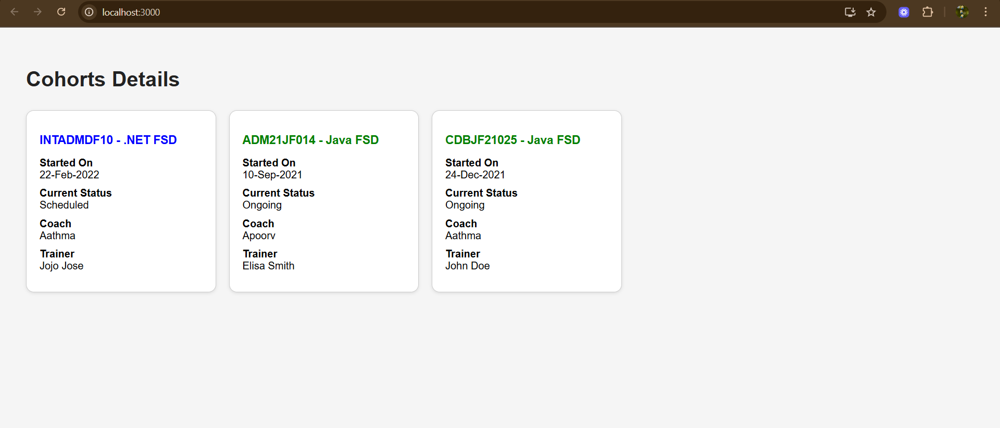

# Exercise 5: Cohort Tracker

## Overview
This exercise demonstrates building a React application for tracking cohort information with detailed views and CSS modules for styling.

## Output

## Key Learnings
- Advanced component styling with CSS modules
- Managing complex application state
- Creating detailed information displays
- Modular CSS architecture in React
