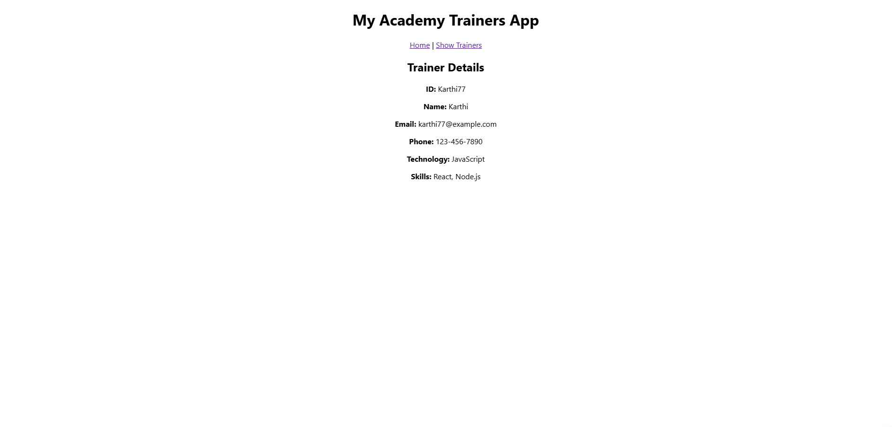

# Exercise 6: Trainers App

## Overview
This exercise demonstrates building a React application for managing trainer information with navigation, routing, and detailed trainer profiles using React Router DOM.

## Output

## Key Learnings
- React Router DOM for navigation
- Component-based architecture for trainer management
- Managing trainer data with mock data
- Creating detailed trainer profile views
- Multi-component React application structure
- Routing between different views and components
