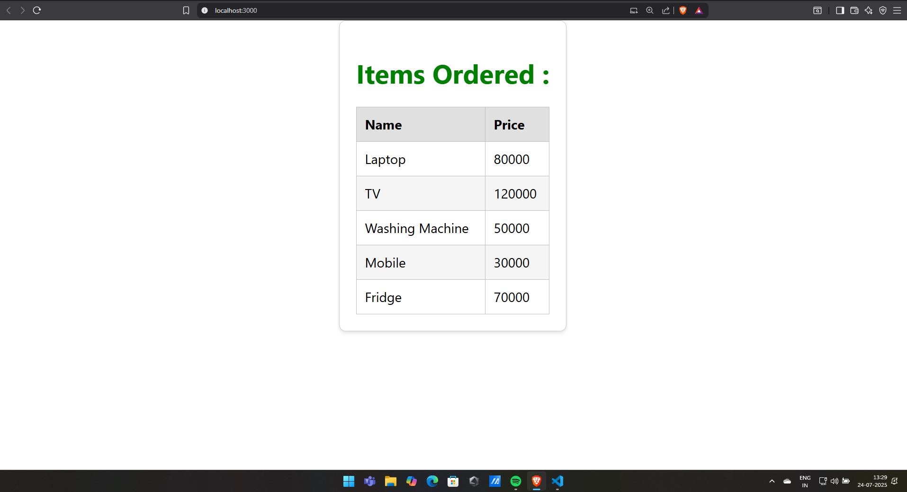

# Exercise 7: Shopping App

## Overview
This exercise demonstrates building a React shopping application with product management, cart functionality, and user interaction features for e-commerce operations.

## Output

## Key Learnings
- E-commerce application development with React
- Shopping cart functionality implementation
- Product display and management
- User interaction and event handling
- State management for shopping operations
- Component lifecycle for dynamic content updates
