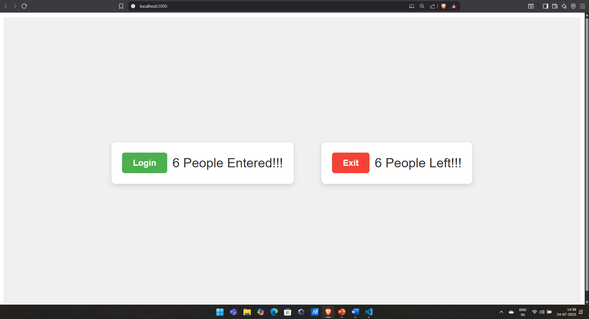

# Exercise 8: Counter App

## Overview
This exercise demonstrates building a React counter application that showcases state management, event handling, and dynamic UI updates with increment and decrement functionality.

## Output

## Key Learnings
- React state management with useState hook
- Event handling for button clicks
- Dynamic UI updates based on state changes
- Component re-rendering and lifecycle
- Simple interactive React application development
- Understanding React hooks and functional components
