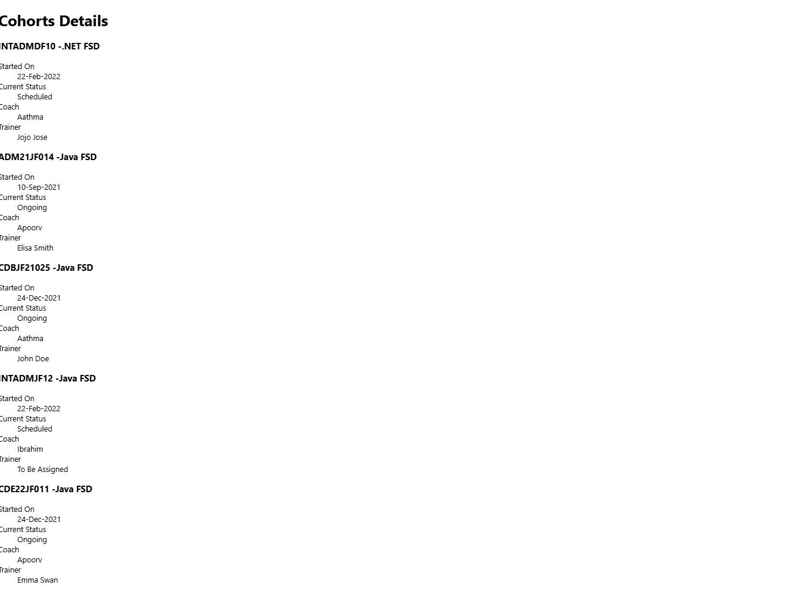

# React 18: Cohort Tracker

## Overview
This exercise demonstrates building a React application for tracking cohort information with detailed student management and progress monitoring features.

## Output

## Key Learnings
- Advanced cohort management system
- Student progress tracking functionality
- Data visualization for educational metrics
- Complex state management for cohort data
- Educational application development patterns
- Interactive dashboard components
