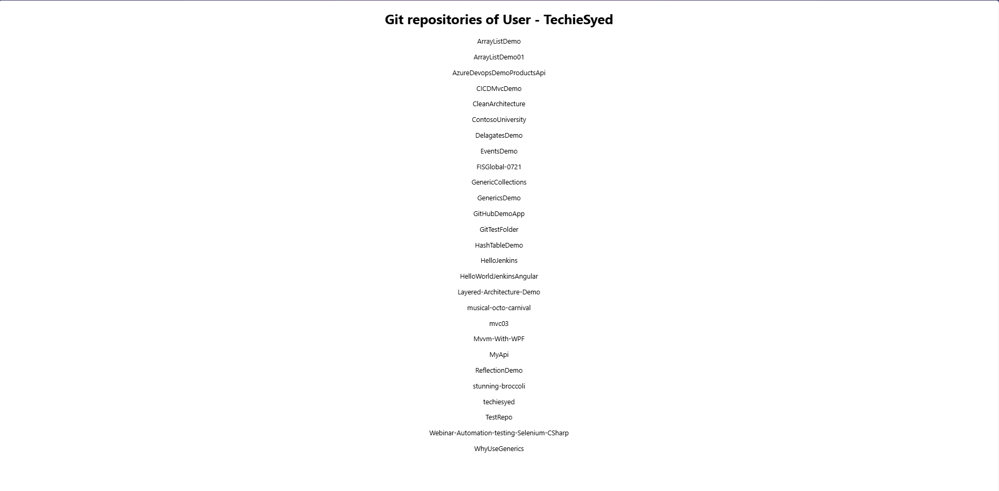

# React 19: Git Client App

## Overview
This exercise demonstrates building a React application that interfaces with Git repositories, providing version control functionality and repository management features.

## Output

## Key Learnings
- Git API integration with React
- Repository management interface
- Version control visualization
- GitHub/GitLab API consumption
- Developer tool creation with React
- File tree and commit history display