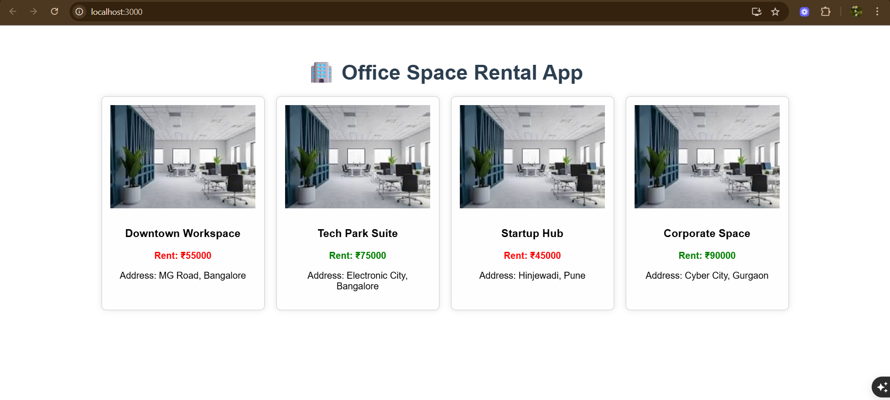

# Exercise 10: Office Space Rental App

## Overview
This exercise demonstrates building a React application for managing office space rentals with booking functionality and property management features.

## Output

## Key Learnings
- Real estate application development with React
- Property listing and management
- Booking and rental functionality
- Form handling for property information
- Component-based architecture for business applications
