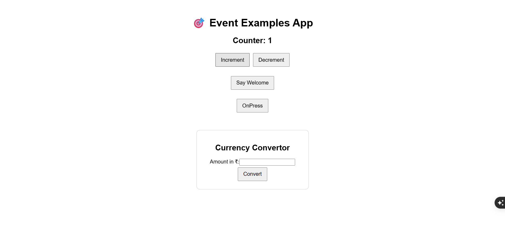
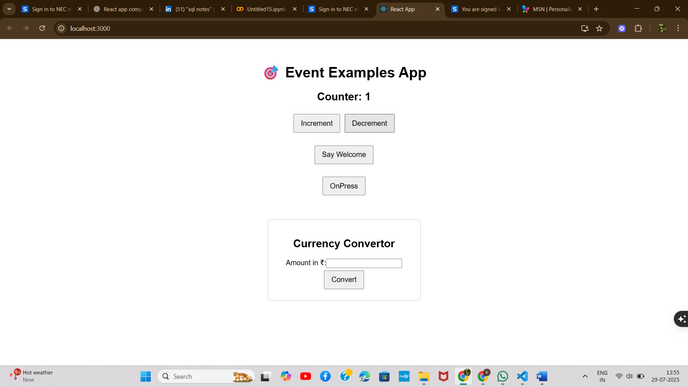
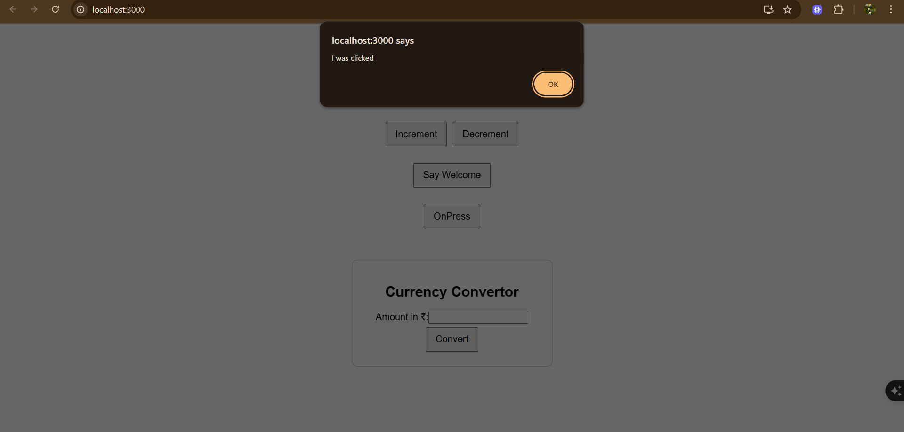
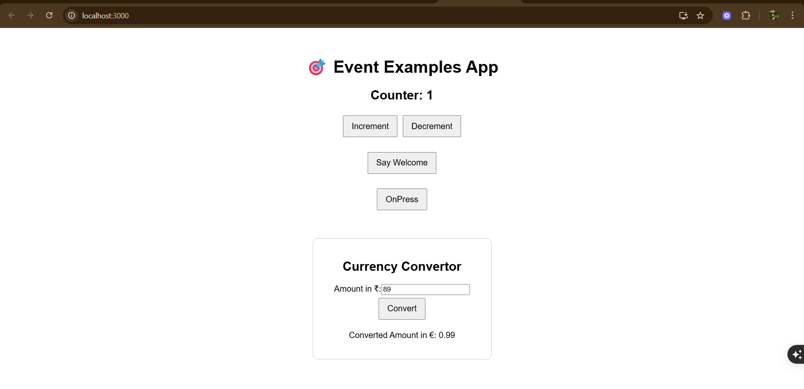

# Exercise 11: Currency Converter

## Overview
This exercise demonstrates building a React currency converter application with real-time exchange rates and multiple currency support.

## Output

## Key Learnings
- API integration for real-time data
- Financial application development
- Form handling and user input validation
- Mathematical calculations in React
- Multiple currency support and conversion logic
