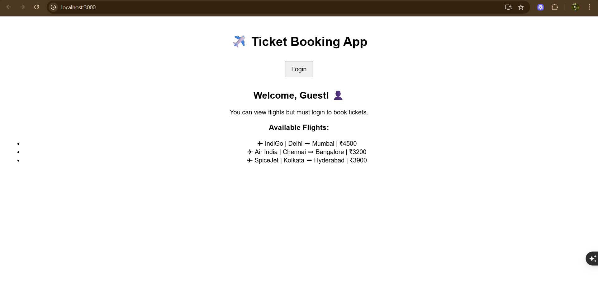
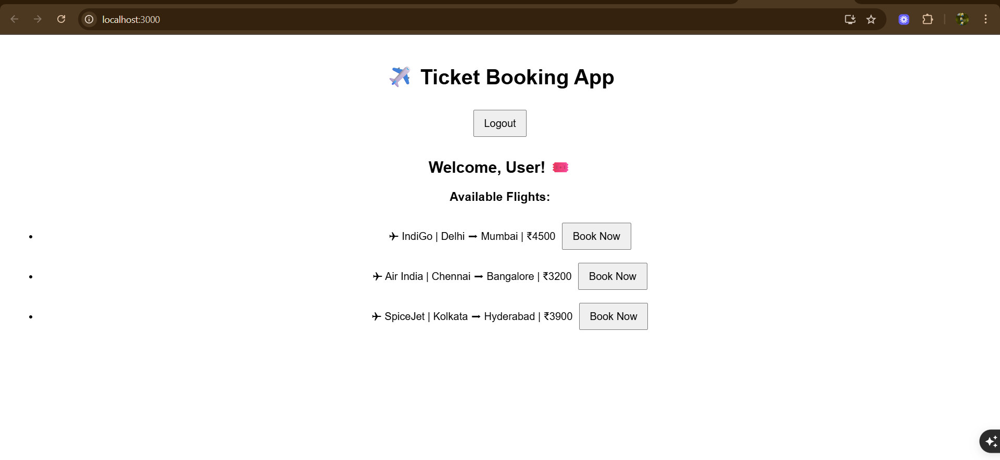

# Exercise 12: Ticket Booking App

## Overview
This exercise demonstrates building a React ticket booking application with seat selection, booking management, and payment processing features.

## Output

## Key Learnings
- Booking system development with React
- Seat selection and reservation logic
- Payment processing integration
- User interface for booking workflows
- State management for complex booking scenarios
