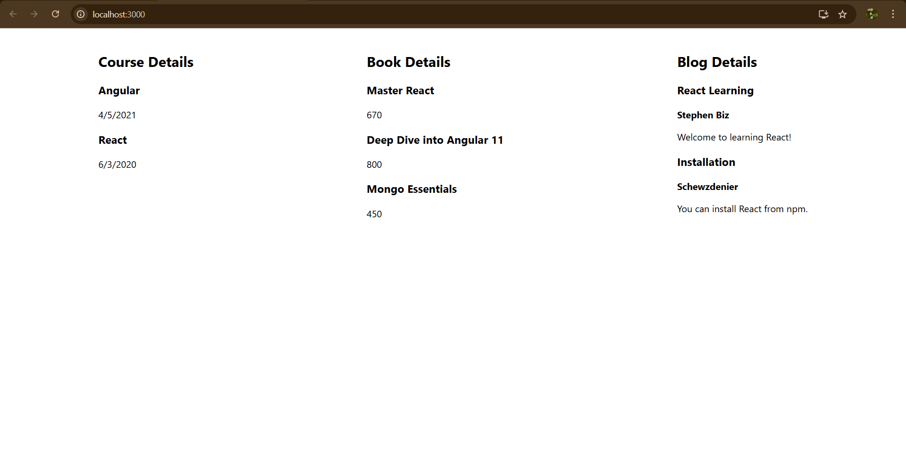

# Exercise 13: Blogger App

## Overview
This exercise demonstrates building a React blogging application with post creation, editing, and management functionality for content publishing.

## Output

## Key Learnings
- Content management system development
- Blog post creation and editing
- Rich text handling and formatting
- User authentication for blog management
- CRUD operations for blog content
