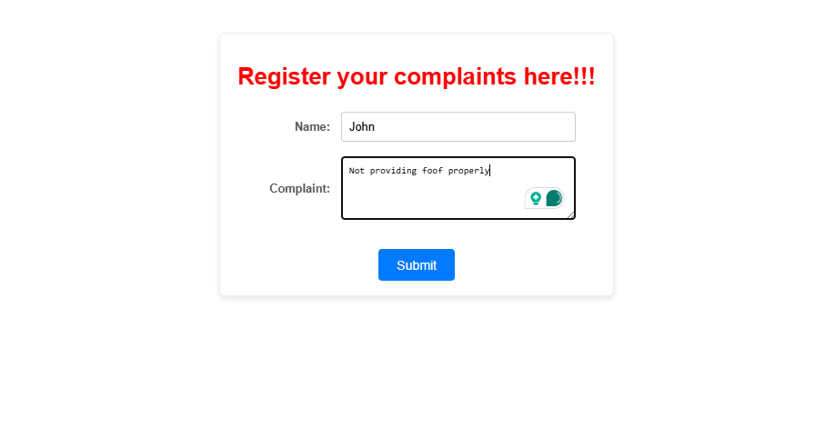
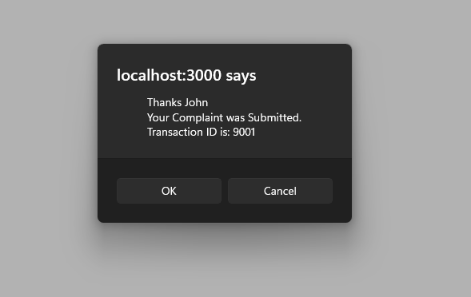

# Exercise 15: Ticket Raising App

## Overview
This exercise demonstrates building a React application for IT support ticket management with ticket creation, tracking, and resolution workflow features.

## Output

## Key Learnings
- IT support ticket system development
- Ticket lifecycle management
- Priority and category handling
- User authentication and role-based access
- Workflow management in React
- Support system interface design