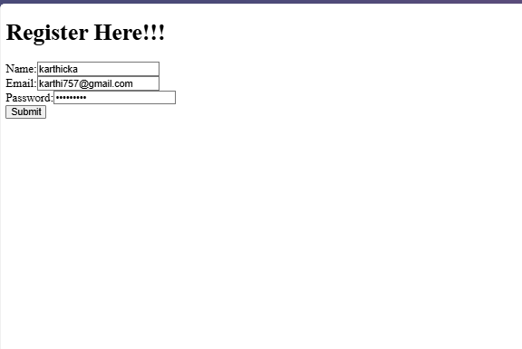
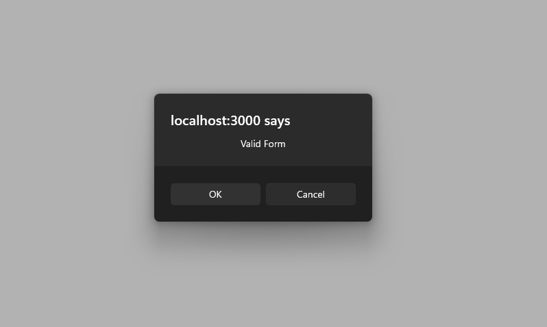

# Exercise 16: Mail Register App

## Overview
This exercise demonstrates building a React application for email registration and management with user authentication, email verification, and subscriber management features.

## Output

## Key Learnings
- Email registration system development
- User authentication and verification
- Form validation and error handling
- Email service integration
- Subscriber management interface
- Newsletter and mailing list functionality