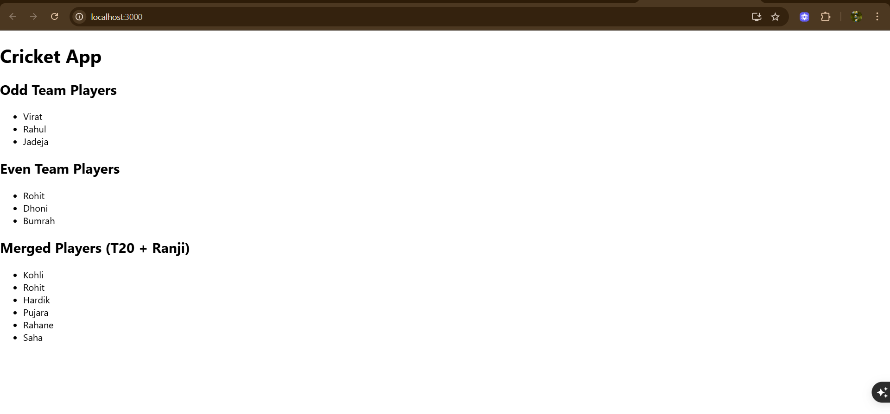
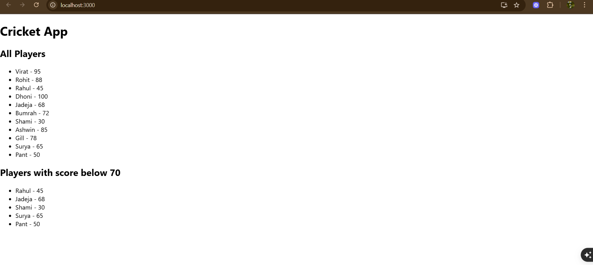

# Exercise 9: Cricket App

## Overview
This exercise demonstrates building a React application for managing cricket-related data with interactive components and dynamic content display.

## Output

## Key Learnings
- React component architecture for sports applications
- Managing cricket data and statistics
- Interactive UI components for sports information
- Dynamic data rendering and state management
- Component lifecycle and event handling
